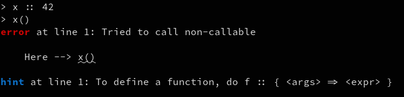
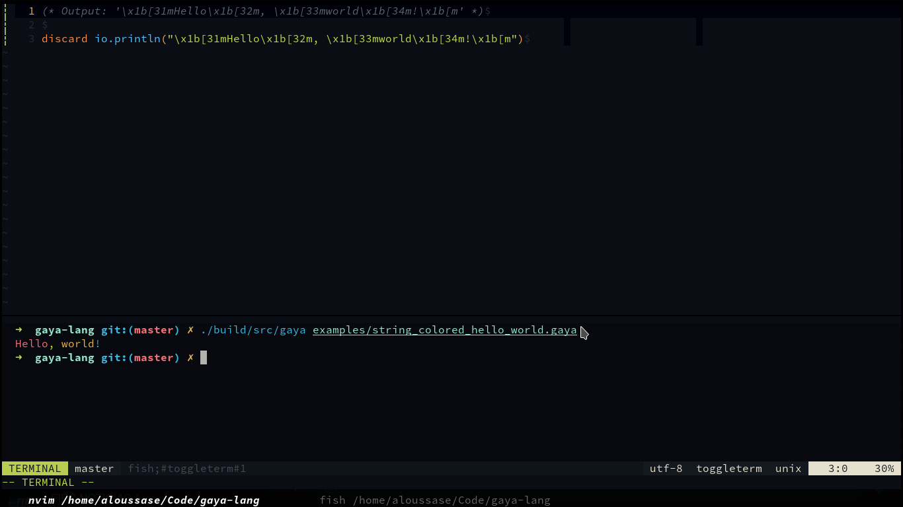

### Gaya

Gaya is a scripting language I made for doing AoC problems in 2023.
The name comes from my favourite cat.

Since its a toy language, its focus is on elegance above anything else. I
wanted something that makes me feel pleasure every time I use it. I hope this
way I can give pleasure to you too.

#### Features

<p align="center">
  
</p>
<p align="center">Nice error messages</p>

<p align="center">
  
</p>
<p align="center">Escape sequences in strings</p>

#### Documentation

##### Comments

Comments follow OCaml style

```ocaml
(* This is a comment *)

(*
  Works across multiple lines as well.
*)
```

##### Literals

```ocaml
 (* string *)
"Hello world"

(* numbers are C++ doubles *)
42
42.69
-42

(* Booleans are C style ;) *)

(* Unit *)
unit
```

##### Arithmetic

Arithmetic operations work as you would exepct in most programming languages:

```perl
42 + 27 (* 69 *)
70 - 1  (* 69 *)
69 * 1  (* 69 *)

(* Division by zero returns unit, you can check for this with typeof *)
let result = 69 / 0 in
cases
  given typeof(result) == "unit" => io.println("Oops")
  otherwise                      => io.println(result)
end

(* Associativy and precedence works as expected *)
42 + 14 * 2 - 1 (* 69 *)
```

##### Truthiness

All values but the empty string, unit and zero are considered to be truthy.

```perl
test :: { x =>
  cases
    given x   => io.println("t")
    otherwise => io.println("f")
  end
}

discard test(42)    (* Truthy *)
discard test("42")  (* Truthy *)
discard test(unit)  (* Falsey *)
discard test("")    (* Falsey *)
discard test(0)     (* Falsey *)
```

#### Comparison

Objects of different types cannot be compared except with the `==` operator, in
which case they are not considered equal. Otherwise, comparison operators work
as you'd expect in most languages.

```ocaml
"Hello" < "Zap" (* t *)
42 >= 42        (* t *)
"str" == 42     (* f *)
```

#### Functions

TODO

### Let Expression

TODO

#### Cases Expression

TODO

#### Do Expression

TODO

#### Assignment

TODO

#### Closures

TODO

#### License

MIT
